# VERY COOL, TERMINAL-BASED, DOCKER PURGING COMMANDS

by [Vernard](https://vernard.net)

These scripts provide an interactive wrapper for Docker's native system prune commands. They clear out unused Docker assets safely and
quickly.

## Warnings and Disclaimers

These commands are destructive. Option 1 stops all running containers, kills all stopped containers, strips all unreferenced images,
clears unused networks, removes unused named and anonymous volumes, and clears the build cache. Data residing in unused volumes will be
permanently erased. Proceed with caution. After pruning images, you may need to pull them again later, which can take time and may count
against registry pull limits such as Docker Hub rate limits.

### Prerequisites

**macOS and Linux**: Make the shell script executable. Run `chmod +x ./mac-linux/docker-purge.sh` in your terminal.

**Windows**: PowerShell blocks unsigned scripts by default. You need to bypass this restriction for your active session. Run
`Set-ExecutionPolicy Bypass -Scope Process` before executing the script.

### Usage

Run the script from wherever you place it. If you keep the repository structure, use the commands below.

#### macOS and Linux:

```shell
./mac-linux/docker-purge.sh
```


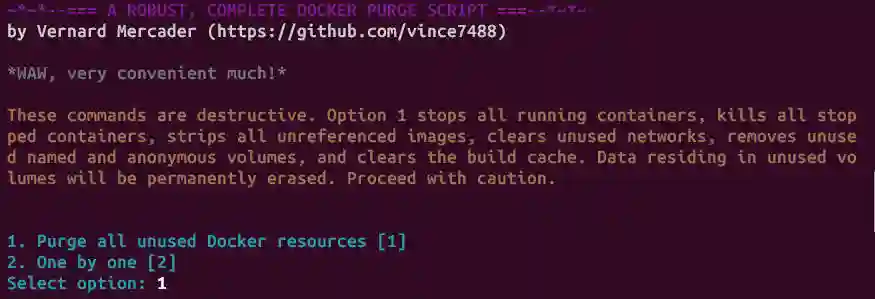

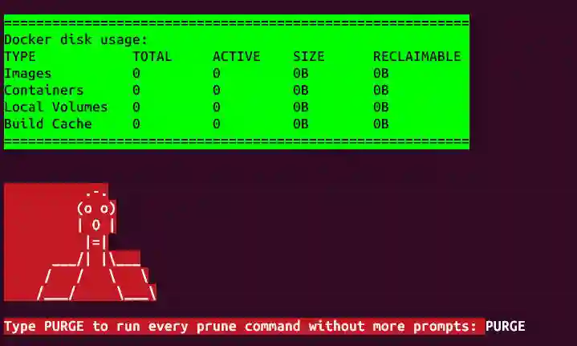

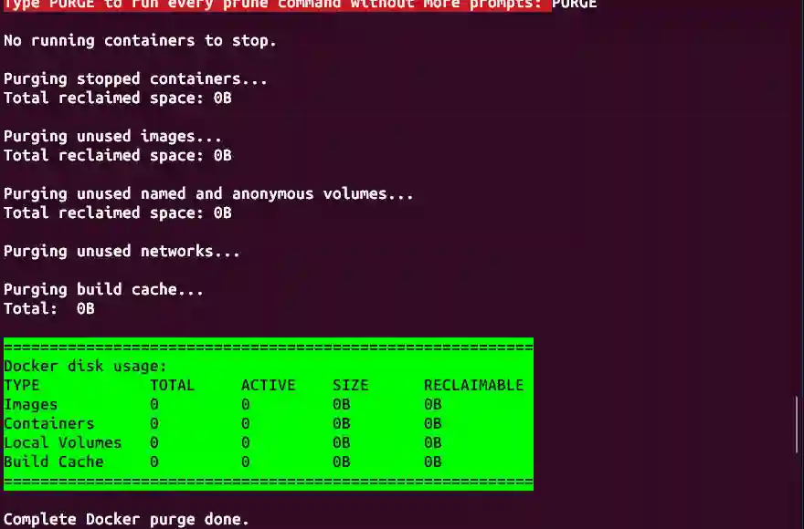

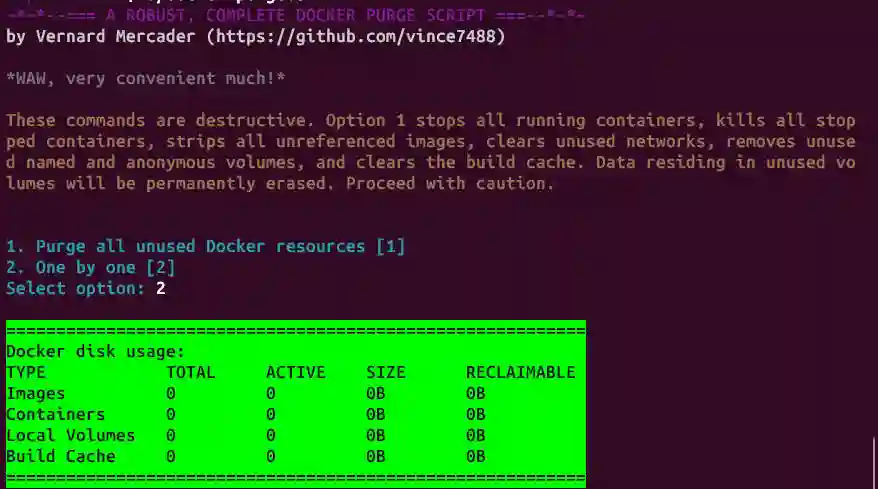

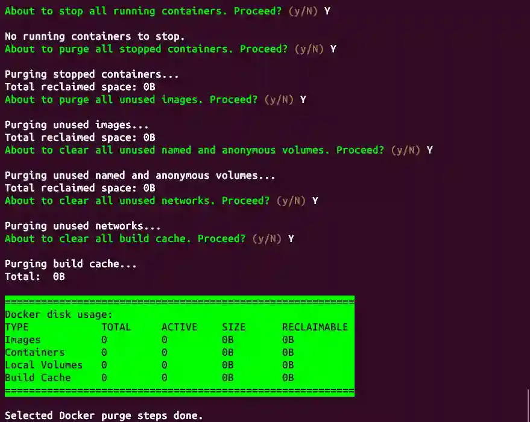

#### Windows:

```shell
.\docker-purge.ps1
```

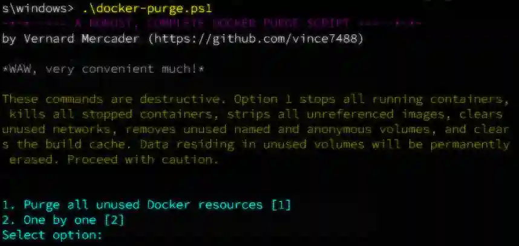

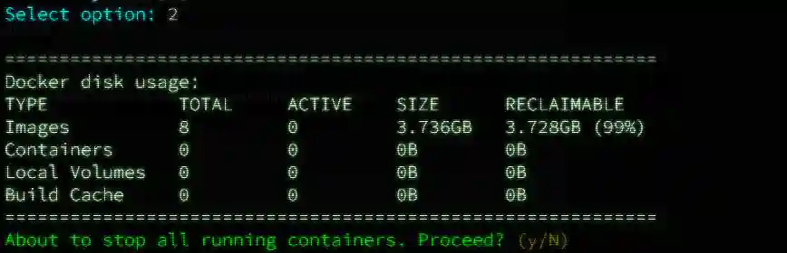

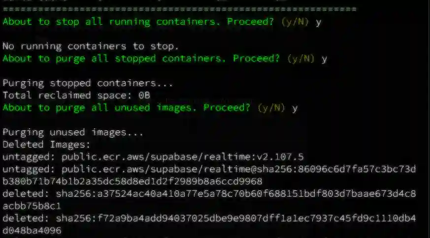

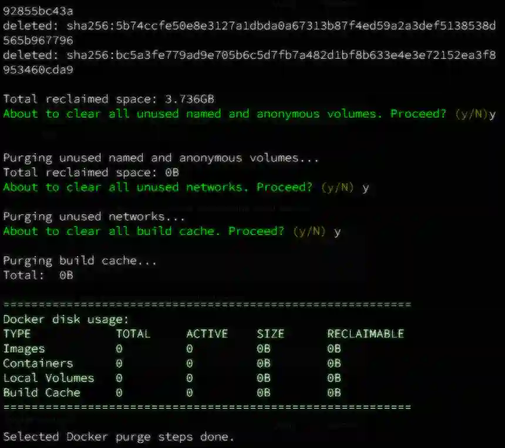

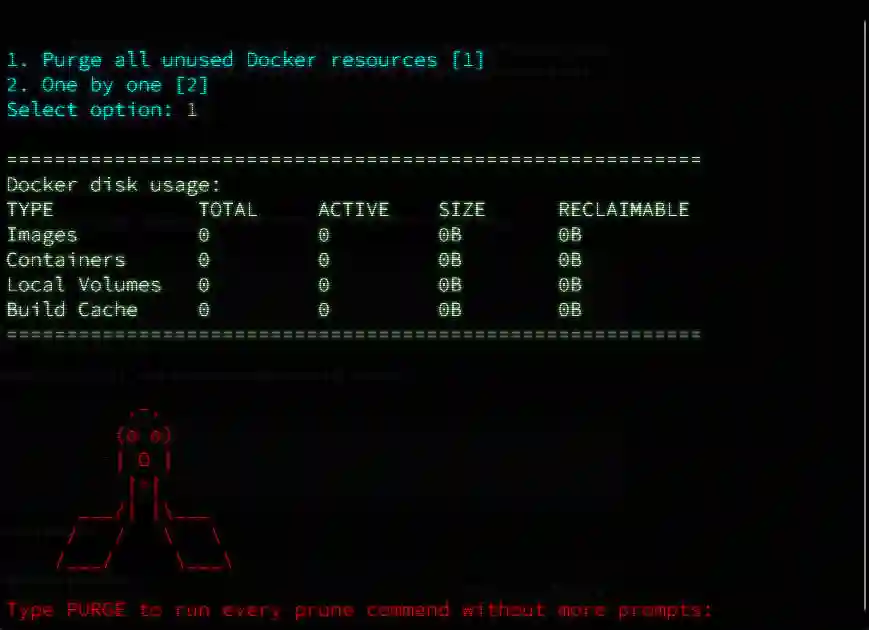

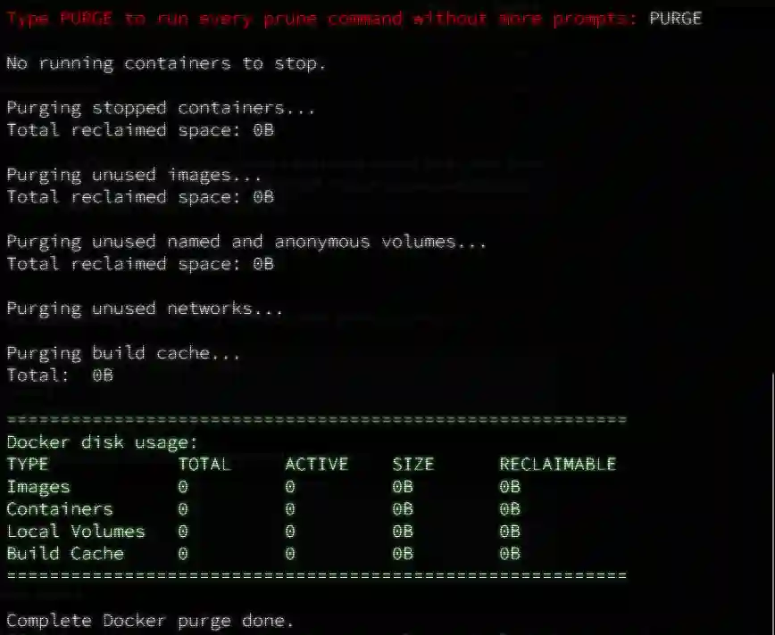

### Under the Hood

The script offers two paths.

Both paths show `docker system df` before and after cleanup so you can see Docker disk usage before the purge and what changed afterward.

#### Option 1: Complete Wipe

This shows the Docker disk usage preview, requires you to type `PURGE`, then runs the full purge sequence without more prompts:

1. Stop all running containers
1. Prune stopped containers
1. Prune unused images
1. Prune unused named and anonymous volumes
1. Prune unused networks
1. Prune the build cache

#### Option 2: Step-by-Step

This isolates the teardown process. It prompts for a yes or no confirmation before stopping running containers, then running individual
prune commands for containers, images, volumes, networks, and the build cache.

---

Just saying... This really is the be-all and end-all Docker clearing script.

## License

This project is licensed under the GNU General Public License Version 2 (GPLv2). See the LICENSE file for details.
